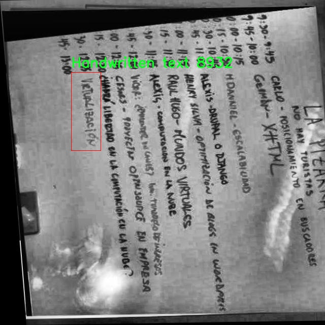

# 黑板手写文本检测检测系统源码分享
 # [一条龙教学YOLOV8标注好的数据集一键训练_70+全套改进创新点发刊_Web前端展示]

### 1.研究背景与意义

项目参考[AAAI Association for the Advancement of Artificial Intelligence](https://gitee.com/qunmasj/projects)

项目来源[AACV Association for the Advancement of Computer Vision](https://kdocs.cn/l/cszuIiCKVNis)

研究背景与意义

随着信息技术的迅猛发展，人工智能在各个领域的应用逐渐深入，尤其是在图像处理和计算机视觉领域。手写文本识别作为一种重要的研究方向，广泛应用于教育、文档数字化、智能办公等场景。传统的手写文本识别方法往往依赖于复杂的特征提取和分类算法，难以适应多样化的手写风格和环境变化。因此，基于深度学习的目标检测技术逐渐成为研究的热点，其中YOLO（You Only Look Once）系列模型因其高效性和实时性受到广泛关注。

在众多YOLO模型中，YOLOv8作为最新版本，具有更强的特征提取能力和更高的检测精度，适合用于复杂场景下的目标检测任务。然而，针对黑板手写文本的检测，现有的YOLOv8模型仍存在一定的局限性。黑板手写文本通常具有多样的字体、大小和书写风格，同时受环境光照、背景杂乱等因素的影响，导致检测效果不佳。因此，针对这一特定场景，改进YOLOv8模型以提升其在黑板手写文本检测中的性能，具有重要的研究意义。

本研究将构建一个基于改进YOLOv8的黑板手写文本检测系统，利用新收集的包含3600张图像的数据集进行训练和测试。该数据集包含两类目标：手写文本和白板，旨在为模型提供丰富的样本和多样化的场景。通过对数据集的深入分析和处理，我们将对图像进行预处理，以增强模型的鲁棒性。同时，结合YOLOv8的优势，针对黑板手写文本的特征进行特定的网络结构优化和参数调整，以提高检测精度和速度。

本研究的意义不仅在于提升黑板手写文本的检测能力，更在于推动智能教育和数字化教学的发展。通过实现高效的手写文本检测系统，教师可以更方便地将黑板上的内容转化为数字文本，减少信息传递的误差，提高教学效率。此外，该系统还可以为后续的智能批改、知识管理等应用提供基础支持，助力教育信息化的进程。

综上所述，基于改进YOLOv8的黑板手写文本检测系统的研究，既是对现有技术的挑战与创新，也是对教育领域智能化发展的积极探索。通过这一研究，我们期望能够为手写文本识别技术的发展提供新的思路和方法，为实际应用场景中的文本处理提供更为高效、准确的解决方案。

### 2.图片演示


##### 注意：由于此博客编辑较早，上面“2.图片演示”和“3.视频演示”展示的系统图片或者视频可能为老版本，新版本在老版本的基础上升级如下：（实际效果以升级的新版本为准）

  （1）适配了YOLOV8的“目标检测”模型和“实例分割”模型，通过加载相应的权重（.pt）文件即可自适应加载模型。

  （2）支持“图片识别”、“视频识别”、“摄像头实时识别”三种识别模式。

  （3）支持“图片识别”、“视频识别”、“摄像头实时识别”三种识别结果保存导出，解决手动导出（容易卡顿出现爆内存）存在的问题，识别完自动保存结果并导出到tempDir中。

  （4）支持Web前端系统中的标题、背景图等自定义修改，后面提供修改教程。

  另外本项目提供训练的数据集和训练教程,暂不提供权重文件（best.pt）,需要您按照教程进行训练后实现图片演示和Web前端界面演示的效果。

### 3.视频演示

[3.1 视频演示](https://www.bilibili.com/video/BV1SNtreZEAs/)

### 4.数据集信息展示

##### 4.1 本项目数据集详细数据（类别数＆类别名）

nc: 2
names: ['Handwritten text', 'Whiteboard']


##### 4.2 本项目数据集信息介绍

数据集信息展示

在本研究中，我们使用了名为“new Dataset”的数据集，以支持对YOLOv8模型的改进，专注于黑板手写文本的检测系统。该数据集专门设计用于捕捉和识别两种主要类别的内容：手写文本和白板。这一选择不仅反映了实际应用场景的需求，也为模型的训练提供了丰富的多样性和复杂性。

“new Dataset”包含了多样化的图像样本，涵盖了不同书写风格、字迹清晰度和背景环境。这些样本在拍摄时考虑到了多种光照条件和角度变化，确保模型在各种现实场景中都能保持良好的检测性能。手写文本类别的样本主要来源于教育环境，展示了教师在黑板上书写的内容，包括字母、数字以及简单的图形。这些样本的多样性使得模型能够学习到不同书写风格的特征，从而提高其在实际应用中的适应能力。

另一方面，白板类别则主要包括了在不同类型的白板上书写的文本。这些文本可能是学生的笔记、课堂讨论的要点或是其他教育活动中产生的内容。由于白板的光滑表面和反射特性，白板上的书写与黑板有所不同，这为模型提供了更广泛的学习空间。通过将这两种类别结合在一起，数据集不仅增强了模型的泛化能力，还提升了其在多种环境下的实用性。

在数据集的构建过程中，特别注重了标注的准确性和一致性。每一张图像都经过精细的标注，确保手写文本和白板内容的边界框准确无误。这一过程不仅需要专业的标注人员进行细致的工作，还依赖于高效的标注工具，以提高标注的效率和质量。数据集的每个样本都附带了详细的元数据，包括图像的拍摄时间、地点以及相关的背景信息，这为后续的分析和模型评估提供了重要的参考。

为了确保模型的训练效果，数据集还经过了合理的划分，分为训练集、验证集和测试集。这样的划分不仅有助于模型的训练过程，也为后续的性能评估提供了科学依据。训练集用于模型的学习，验证集用于调优超参数，而测试集则用于最终的性能评估，确保模型在未见数据上的表现。

总之，“new Dataset”作为本研究的核心数据来源，凭借其丰富的类别和高质量的样本，为改进YOLOv8的黑板手写文本检测系统提供了坚实的基础。通过对该数据集的深入分析和应用，我们期望能够显著提升模型在实际应用中的检测精度和鲁棒性，为教育领域的智能化发展贡献一份力量。





### 5.全套项目环境部署视频教程（零基础手把手教学）

[5.1 环境部署教程链接（零基础手把手教学）](https://www.ixigua.com/7404473917358506534?logTag=c807d0cbc21c0ef59de5)


[5.2 安装Python虚拟环境创建和依赖库安装视频教程链接（零基础手把手教学）](https://www.ixigua.com/7404474678003106304?logTag=1f1041108cd1f708b01a)

### 6.手把手YOLOV8训练视频教程（零基础小白有手就能学会）

[6.1 手把手YOLOV8训练视频教程（零基础小白有手就能学会）](https://www.ixigua.com/7404477157818401292?logTag=d31a2dfd1983c9668658)

### 7.70+种全套YOLOV8创新点代码加载调参视频教程（一键加载写好的改进模型的配置文件）

[7.1 70+种全套YOLOV8创新点代码加载调参视频教程（一键加载写好的改进模型的配置文件）](https://www.ixigua.com/7404478314661806627?logTag=29066f8288e3f4eea3a4)

### 8.70+种全套YOLOV8创新点原理讲解（非科班也可以轻松写刊发刊，V10版本正在科研待更新）

由于篇幅限制，每个创新点的具体原理讲解就不一一展开，具体见下列网址中的创新点对应子项目的技术原理博客网址【Blog】：


[8.1 70+种全套YOLOV8创新点原理讲解链接](https://gitee.com/qunmasj/good)

### 9.系统功能展示（检测对象为举例，实际内容以本项目数据集为准）

图9.1.系统支持检测结果表格显示

  图9.2.系统支持置信度和IOU阈值手动调节

  图9.3.系统支持自定义加载权重文件best.pt(需要你通过步骤5中训练获得)

  图9.4.系统支持摄像头实时识别

  图9.5.系统支持图片识别

  图9.6.系统支持视频识别

  图9.7.系统支持识别结果文件自动保存

  图9.8.系统支持Excel导出检测结果数据


### 10.原始YOLOV8算法原理

原始YOLOv8算法原理

YOLO（You Only Look Once）系列算法自其首次提出以来，便以其卓越的实时目标检测能力而广受关注。YOLOv8作为该系列的最新版本，进一步推动了目标检测技术的发展，其设计理念和结构优化使得该算法在检测精度和速度上均表现出色。YOLOv8的架构主要由四个核心部分组成：输入模块、Backbone骨干网络、Neck特征融合网络和Head检测模块。这些模块的协同工作使得YOLOv8能够在复杂的视觉任务中实现高效的目标检测。

在输入模块中，YOLOv8首先对输入图像进行预处理，包括调整图像比例、进行Mosaic增强以及计算瞄点。这些预处理步骤旨在提升模型对不同输入图像的适应能力，从而增强后续特征提取的有效性。Mosaic增强技术通过将多张图像拼接在一起，增加了训练样本的多样性，帮助模型更好地学习到不同场景下的特征。

YOLOv8的Backbone部分沿用了DarkNet结构，但在此基础上进行了重要的改进。与之前版本相比，YOLOv8引入了C2f模块替代了C3模块，优化了特征提取的效率。C2f模块通过引入跨级连接的方式，促进了梯度流动，确保了信息在网络中的有效传递。此外，YOLOv8针对不同尺度的模型调整了通道数，以获取更丰富的特征信息。这种设计不仅保留了轻量级特性，还增强了模型对多尺度目标的检测能力。

在特征融合方面，YOLOv8的Neck模块采用了“双塔结构”，结合了特征金字塔和路径聚合网络。这种设计促进了语义特征与定位特征之间的有效转移，使得网络能够更好地融合不同层次的特征信息，从而提高了对不同尺度目标的检测性能。特征金字塔网络（FPN）在此发挥了重要作用，它通过自上而下的特征融合，使得高层语义信息与低层细节信息得以结合，进一步提升了检测的准确性。

YOLOv8的Head模块则包含了三个解耦的Detect检测器，采用了回归分支和预测分支的分离结构。这种解耦设计不仅加速了模型的收敛速度，还提高了目标检测的精度。通过将分类和回归任务分开处理，YOLOv8能够更专注于每个任务的优化，从而在复杂场景中实现更高的检测性能。

在损失函数的设计上，YOLOv8引入了新的损失策略，采用变焦损失计算分类损失，并结合数据平均保真度损失和完美交并比损失来计算边界框损失。这种新的损失策略使得YOLOv8在处理目标检测任务时，能够更加准确地优化模型参数，从而提高了目标检测的整体性能。通过精确的损失计算，YOLOv8能够更好地适应不同的目标特征，提升了模型的泛化能力。

总的来说，YOLOv8在设计上充分考虑了目标检测的实际需求，通过一系列的结构优化和损失函数改进，使得该算法在保持高效性的同时，显著提升了检测精度。这些创新不仅增强了YOLOv8在多种应用场景下的适用性，也为后续的目标检测研究提供了新的思路和方向。通过对YOLOv8的深入理解和应用，研究者们能够在更广泛的领域中探索目标检测技术的潜力，推动智能视觉系统的发展。


### 11.项目核心源码讲解（再也不用担心看不懂代码逻辑）

#### 11.1 70+种YOLOv8算法改进源码大全和调试加载训练教程（非必要）\ultralytics\utils\callbacks\__init__.py

下面是对给定代码的核心部分进行分析和详细注释的结果：

```python
# 导入Ultralytics YOLO库中的基础模块
from .base import add_integration_callbacks, default_callbacks, get_default_callbacks

# 定义当前模块的公开接口，包含三个函数
__all__ = 'add_integration_callbacks', 'default_callbacks', 'get_default_callbacks'
```

### 代码分析与注释：

1. **模块导入**：
   ```python
   from .base import add_integration_callbacks, default_callbacks, get_default_callbacks
   ```
   - 这一行代码从当前包的 `base` 模块中导入了三个核心功能：
     - `add_integration_callbacks`: 可能用于添加集成回调的函数。
     - `default_callbacks`: 可能是一个默认回调的集合。
     - `get_default_callbacks`: 可能用于获取默认回调的函数。

2. **公开接口定义**：
   ```python
   __all__ = 'add_integration_callbacks', 'default_callbacks', 'get_default_callbacks'
   ```
   - `__all__` 是一个特殊变量，用于定义当使用 `from module import *` 时，哪些名称是可以被导入的。
   - 在这里，定义了三个函数名称，使得它们可以被外部模块访问，从而提高了模块的可用性和清晰度。

### 总结：
该代码片段主要负责从基础模块中导入一些核心功能，并定义了模块的公开接口，以便其他模块可以方便地使用这些功能。

这个文件是Ultralytics YOLO项目中的一个初始化文件，位于`utils/callbacks`目录下。文件的开头包含了一条版权声明，表明该代码遵循AGPL-3.0许可证，这是一种开源许可证，允许用户自由使用、修改和分发代码，但要求在分发时保持相同的许可证。

在代码的主体部分，文件从`base`模块中导入了三个函数：`add_integration_callbacks`、`default_callbacks`和`get_default_callbacks`。这些函数可能与回调机制有关，回调通常用于在特定事件发生时执行某些操作，比如在训练过程中记录指标、调整学习率等。

最后，`__all__`变量被定义为一个元组，包含了上述导入的三个函数名。这意味着当使用`from module import *`语句导入该模块时，只会导入`__all__`中列出的名称，从而控制模块的公共接口，避免不必要的名称冲突。

总的来说，这个文件的主要作用是作为一个模块的入口，整合并暴露与回调相关的功能，以便其他模块或文件可以方便地使用这些功能。

#### 11.2 code\ultralytics\models\sam\modules\encoders.py

以下是经过简化和注释的核心代码部分，主要包括 `ImageEncoderViT` 和 `PatchEmbed` 类。这些类是实现视觉变换器（ViT）架构的关键部分，用于将图像编码为紧凑的潜在空间。

```python
import torch
import torch.nn as nn
from typing import Optional, Tuple

class PatchEmbed(nn.Module):
    """图像到补丁嵌入的模块。"""

    def __init__(self, kernel_size: Tuple[int, int] = (16, 16), in_chans: int = 3, embed_dim: int = 768) -> None:
        """
        初始化 PatchEmbed 模块。

        Args:
            kernel_size (Tuple): 卷积核的大小。
            in_chans (int): 输入图像的通道数。
            embed_dim (int): 补丁嵌入的维度。
        """
        super().__init__()
        # 使用卷积层将图像转换为补丁嵌入
        self.proj = nn.Conv2d(in_chans, embed_dim, kernel_size=kernel_size)

    def forward(self, x: torch.Tensor) -> torch.Tensor:
        """通过卷积计算补丁嵌入，并转置结果张量。"""
        return self.proj(x).permute(0, 2, 3, 1)  # 将形状从 [B, C, H, W] 转换为 [B, H, W, C]


class ImageEncoderViT(nn.Module):
    """
    使用视觉变换器（ViT）架构的图像编码器，将图像编码为紧凑的潜在空间。
    """

    def __init__(self, img_size: int = 1024, patch_size: int = 16, in_chans: int = 3, embed_dim: int = 768, depth: int = 12) -> None:
        """
        初始化图像编码器。

        Args:
            img_size (int): 输入图像的大小。
            patch_size (int): 补丁的大小。
            in_chans (int): 输入图像的通道数。
            embed_dim (int): 补丁嵌入的维度。
            depth (int): ViT 的深度，即变换器块的数量。
        """
        super().__init__()
        self.img_size = img_size

        # 初始化补丁嵌入模块
        self.patch_embed = PatchEmbed(kernel_size=(patch_size, patch_size), in_chans=in_chans, embed_dim=embed_dim)

        # 初始化变换器块
        self.blocks = nn.ModuleList([Block(embed_dim) for _ in range(depth)])  # 这里 Block 类应当定义为变换器块

        # 颈部模块，用于进一步处理输出
        self.neck = nn.Sequential(
            nn.Conv2d(embed_dim, 256, kernel_size=1, bias=False),  # 将嵌入维度转换为输出通道
            nn.LayerNorm(256),  # 归一化层
            nn.Conv2d(256, 256, kernel_size=3, padding=1, bias=False),  # 进一步卷积处理
            nn.LayerNorm(256),  # 归一化层
        )

    def forward(self, x: torch.Tensor) -> torch.Tensor:
        """处理输入，通过补丁嵌入、变换器块和颈部模块。"""
        x = self.patch_embed(x)  # 通过补丁嵌入处理输入
        for blk in self.blocks:  # 逐个通过变换器块
            x = blk(x)
        return self.neck(x.permute(0, 3, 1, 2))  # 调整维度并通过颈部模块
```

### 代码注释说明
1. **PatchEmbed 类**:
   - 该类负责将输入图像分割成补丁并进行嵌入。使用卷积层来实现这一点，卷积的输出被转置以适应后续处理。

2. **ImageEncoderViT 类**:
   - 该类实现了一个图像编码器，使用 ViT 架构将图像编码为潜在空间。
   - 初始化时设置图像大小、补丁大小、输入通道数、嵌入维度和变换器块的深度。
   - `forward` 方法处理输入图像，通过补丁嵌入、变换器块和颈部模块生成最终的编码表示。

请注意，`Block` 类和其他相关的辅助函数（如 `Attention` 和 `window_partition`）在此示例中未被定义，但它们在完整实现中是必不可少的。

这个程序文件定义了一个用于图像编码的模块，主要基于视觉变换器（Vision Transformer, ViT）架构。文件中包含多个类，每个类负责不同的功能。

首先，`ImageEncoderViT`类是图像编码器的核心部分。它的构造函数接受多个参数，包括输入图像的大小、补丁大小、输入通道数、嵌入维度、深度、注意力头数等。该类的主要功能是将输入图像分割成多个补丁，并通过一系列的变换块处理这些补丁。编码后的补丁随后通过一个“颈部”模块进一步处理，以生成最终的编码表示。

在`__init__`方法中，首先初始化了图像大小和补丁嵌入模块。接着，如果使用绝对位置嵌入，则初始化相应的参数。然后，构建了一系列的变换块，这些块通过`Block`类实现。最后，定义了一个颈部模块，该模块包括多个卷积层和层归一化，用于进一步处理输出。

`forward`方法定义了前向传播的过程，首先通过补丁嵌入模块处理输入图像，然后如果存在位置嵌入，则将其添加到补丁嵌入中。接着，依次通过所有的变换块，最后将结果传递给颈部模块以获得最终输出。

接下来是`PromptEncoder`类，它用于编码不同类型的提示，包括点、框和掩码，以便输入到掩码解码器中。该类生成稀疏和密集的嵌入表示。构造函数中初始化了嵌入维度、输入图像大小、图像嵌入大小、掩码输入通道数等参数，并定义了相应的嵌入模块和下采样网络。

`forward`方法处理不同类型的提示，返回稀疏和密集的嵌入。它首先获取批次大小，然后根据输入的点、框和掩码进行相应的嵌入操作。

`PositionEmbeddingRandom`类实现了基于随机空间频率的位置信息编码。它的构造函数初始化了位置编码矩阵，并提供了生成特定大小网格的前向方法。

`Block`类实现了变换块，支持窗口注意力和残差传播。它的构造函数定义了归一化层、注意力模块和多层感知机（MLP）模块。

`Attention`类实现了多头注意力机制，支持相对位置嵌入。它的前向方法计算注意力分数并生成输出。

此外，文件中还定义了一些辅助函数，如`window_partition`和`window_unpartition`，用于将输入张量划分为窗口和反向合并窗口。

最后，`PatchEmbed`类负责将图像转换为补丁嵌入。它使用卷积层来实现这一过程，并在前向传播中返回处理后的张量。

整体来看，这个文件实现了一个强大的图像编码器，利用了现代深度学习中的变换器架构，适用于各种计算机视觉任务。

#### 11.3 ui.py

以下是代码中最核心的部分，并附上详细的中文注释：

```python
import sys
import subprocess

def run_script(script_path):
    """
    使用当前 Python 环境运行指定的脚本。

    Args:
        script_path (str): 要运行的脚本路径

    Returns:
        None
    """
    # 获取当前 Python 解释器的路径
    python_path = sys.executable

    # 构建运行命令，使用 streamlit 运行指定的脚本
    command = f'"{python_path}" -m streamlit run "{script_path}"'

    # 执行命令
    result = subprocess.run(command, shell=True)
    # 检查命令执行的返回码，0 表示成功，非0表示出错
    if result.returncode != 0:
        print("脚本运行出错。")

# 实例化并运行应用
if __name__ == "__main__":
    # 指定要运行的脚本路径
    script_path = "web.py"  # 这里可以替换为实际的脚本路径

    # 调用函数运行脚本
    run_script(script_path)
```

### 代码说明：
1. **导入模块**：
   - `sys`：用于访问与 Python 解释器紧密相关的变量和函数。
   - `subprocess`：用于创建新进程、连接到它们的输入/输出/错误管道，并获得返回码。

2. **`run_script` 函数**：
   - 该函数接收一个脚本路径作为参数，并使用当前 Python 环境运行该脚本。
   - `sys.executable` 获取当前 Python 解释器的路径，以确保使用正确的 Python 版本。
   - 使用 `subprocess.run` 执行构建的命令，`shell=True` 允许在 shell 中执行命令。
   - 检查命令的返回码，如果不为 0，则表示脚本运行出错，并打印错误信息。

3. **主程序块**：
   - 通过 `if __name__ == "__main__":` 确保该代码块仅在脚本直接运行时执行。
   - 指定要运行的脚本路径（这里是 `web.py`），并调用 `run_script` 函数来执行该脚本。

这个程序文件的主要功能是通过当前的 Python 环境来运行一个指定的脚本，具体是一个名为 `web.py` 的文件。程序首先导入了必要的模块，包括 `sys`、`os` 和 `subprocess`，这些模块分别用于访问系统参数、操作系统功能和执行外部命令。

在 `run_script` 函数中，首先获取当前 Python 解释器的路径，这通过 `sys.executable` 实现。接着，构建一个命令字符串，该命令使用 `streamlit` 模块来运行指定的脚本。`streamlit` 是一个用于构建数据应用的流行库，命令的格式是 `python -m streamlit run script_path`。

随后，使用 `subprocess.run` 方法执行构建好的命令。这个方法会在一个新的子进程中运行命令，并等待其完成。如果命令执行的返回码不为零，表示脚本运行出错，程序会打印出错误信息。

在文件的最后部分，使用 `if __name__ == "__main__":` 语句来确保只有在直接运行该文件时才会执行下面的代码。这部分代码指定了要运行的脚本路径，调用 `abs_path` 函数获取 `web.py` 的绝对路径，并最终调用 `run_script` 函数来执行该脚本。

总的来说，这个程序的作用是为用户提供一个简单的方式来运行一个基于 Streamlit 的 Python 脚本，并在出现错误时给出提示。

#### 11.4 code\ultralytics\trackers\track.py

以下是经过简化和注释的核心代码部分：

```python
# 导入必要的库
from functools import partial
from pathlib import Path
import torch
from ultralytics.utils import IterableSimpleNamespace, yaml_load
from ultralytics.utils.checks import check_yaml
from .bot_sort import BOTSORT
from .byte_tracker import BYTETracker

# 跟踪器类型与对应类的映射
TRACKER_MAP = {"bytetrack": BYTETracker, "botsort": BOTSORT}

def on_predict_start(predictor: object, persist: bool = False) -> None:
    """
    在预测开始时初始化对象跟踪器。

    参数:
        predictor (object): 用于初始化跟踪器的预测器对象。
        persist (bool, optional): 如果跟踪器已存在，是否保持其状态。默认为 False。

    异常:
        AssertionError: 如果 tracker_type 不是 'bytetrack' 或 'botsort'。
    """
    # 检查任务类型是否为 OBB，若是则抛出异常
    if predictor.args.task == "obb":
        raise NotImplementedError("ERROR ❌ OBB 任务不支持跟踪模式！")
    
    # 如果预测器已有跟踪器且需要保持状态，则直接返回
    if hasattr(predictor, "trackers") and persist:
        return

    # 加载跟踪器配置
    tracker = check_yaml(predictor.args.tracker)
    cfg = IterableSimpleNamespace(**yaml_load(tracker))

    # 检查跟踪器类型是否合法
    if cfg.tracker_type not in ["bytetrack", "botsort"]:
        raise AssertionError(f"仅支持 'bytetrack' 和 'botsort'，但得到了 '{cfg.tracker_type}'")

    # 初始化跟踪器
    trackers = []
    for _ in range(predictor.dataset.bs):  # 对于每个批次
        tracker = TRACKER_MAP[cfg.tracker_type](args=cfg, frame_rate=30)  # 创建跟踪器实例
        trackers.append(tracker)  # 将跟踪器添加到列表中
    predictor.trackers = trackers  # 将跟踪器列表赋值给预测器

def on_predict_postprocess_end(predictor: object, persist: bool = False) -> None:
    """
    后处理检测到的框并更新对象跟踪。

    参数:
        predictor (object): 包含预测结果的预测器对象。
        persist (bool, optional): 如果跟踪器已存在，是否保持其状态。默认为 False。
    """
    bs = predictor.dataset.bs  # 批次大小
    path, im0s = predictor.batch[:2]  # 获取路径和图像

    for i in range(bs):  # 遍历每个批次
        # 如果不是持久化且视频路径不同，则重置跟踪器
        if not persist and predictor.vid_path[i] != str(predictor.save_dir / Path(path[i]).name):
            predictor.trackers[i].reset()

        det = predictor.results[i].boxes.cpu().numpy()  # 获取检测结果
        if len(det) == 0:  # 如果没有检测到物体，跳过
            continue
        
        # 更新跟踪器并获取跟踪结果
        tracks = predictor.trackers[i].update(det, im0s[i])
        if len(tracks) == 0:  # 如果没有跟踪到物体，跳过
            continue
        
        idx = tracks[:, -1].astype(int)  # 获取跟踪索引
        predictor.results[i] = predictor.results[i][idx]  # 更新结果
        predictor.results[i].update(boxes=torch.as_tensor(tracks[:, :-1]))  # 更新框信息

def register_tracker(model: object, persist: bool) -> None:
    """
    为模型注册跟踪回调，以便在预测期间进行对象跟踪。

    参数:
        model (object): 要注册跟踪回调的模型对象。
        persist (bool): 如果跟踪器已存在，是否保持其状态。
    """
    # 注册预测开始和后处理结束的回调函数
    model.add_callback("on_predict_start", partial(on_predict_start, persist=persist))
    model.add_callback("on_predict_postprocess_end", partial(on_predict_postprocess_end, persist=persist))
```

### 代码说明：
1. **导入模块**：导入必要的库和模块，包括跟踪器的实现。
2. **TRACKER_MAP**：定义一个字典，将跟踪器类型映射到具体的跟踪器类。
3. **on_predict_start**：在预测开始时初始化跟踪器，检查任务类型和跟踪器配置，创建跟踪器实例并保存到预测器中。
4. **on_predict_postprocess_end**：在预测后处理阶段，更新检测结果并进行对象跟踪，处理每个批次的检测框和跟踪器。
5. **register_tracker**：为模型注册跟踪的回调函数，以便在预测过程中自动调用跟踪器的初始化和更新功能。

这个程序文件主要用于实现目标检测中的对象跟踪功能，尤其是与Ultralytics YOLO模型相关的跟踪器。文件中包含了一些重要的函数和类，具体功能如下：

首先，文件导入了一些必要的库和模块，包括`torch`和一些Ultralytics的工具函数。接着，定义了一个跟踪器类型与相应跟踪器类的映射字典`TRACKER_MAP`，其中包含了`BYTETracker`和`BOTSORT`两种跟踪器。

在`on_predict_start`函数中，程序初始化了用于对象跟踪的跟踪器。该函数接收一个预测器对象和一个可选的布尔参数`persist`，用于指示是否在跟踪器已存在的情况下保持其状态。函数首先检查预测任务类型，如果是“obb”则抛出未实现的异常。接着，函数检查预测器是否已经有跟踪器，如果`persist`为真，则直接返回。然后，函数加载跟踪器的配置文件，并确保所使用的跟踪器类型是支持的（即“bytetrack”或“botsort”）。最后，根据批次大小创建相应数量的跟踪器实例，并将其存储在预测器的`trackers`属性中。

`on_predict_postprocess_end`函数则用于在检测框后处理阶段更新对象跟踪。该函数同样接收预测器对象和`persist`参数。函数首先获取批次大小和图像数据，然后遍历每个视频帧。如果`persist`为假且当前视频路径与保存路径不同，则重置对应的跟踪器。接着，函数获取检测结果，如果没有检测到物体则跳过处理。对于检测到的物体，调用对应的跟踪器进行更新，并根据跟踪结果更新预测器的结果。

最后，`register_tracker`函数用于将跟踪回调注册到模型中，以便在预测过程中调用相应的跟踪功能。该函数接收模型对象和`persist`参数，并通过`add_callback`方法将`on_predict_start`和`on_predict_postprocess_end`函数注册为回调函数。

整体而言，这个文件的主要功能是为Ultralytics YOLO模型提供对象跟踪的支持，通过初始化和更新跟踪器来实现对检测到的目标进行持续跟踪。

#### 11.5 train.py

以下是经过简化和注释的核心代码部分：

```python
import random
import numpy as np
import torch.nn as nn
from ultralytics.data import build_dataloader, build_yolo_dataset
from ultralytics.engine.trainer import BaseTrainer
from ultralytics.models import yolo
from ultralytics.nn.tasks import DetectionModel
from ultralytics.utils import LOGGER, RANK
from ultralytics.utils.torch_utils import de_parallel, torch_distributed_zero_first

class DetectionTrainer(BaseTrainer):
    """
    DetectionTrainer类用于基于YOLO模型进行目标检测的训练。
    """

    def build_dataset(self, img_path, mode="train", batch=None):
        """
        构建YOLO数据集。

        参数:
            img_path (str): 包含图像的文件夹路径。
            mode (str): 模式，可以是'train'或'val'，用于自定义不同的增强方式。
            batch (int, optional): 批次大小，适用于'rect'模式。默认为None。
        """
        gs = max(int(de_parallel(self.model).stride.max() if self.model else 0), 32)
        return build_yolo_dataset(self.args, img_path, batch, self.data, mode=mode, rect=mode == "val", stride=gs)

    def get_dataloader(self, dataset_path, batch_size=16, rank=0, mode="train"):
        """构造并返回数据加载器。"""
        assert mode in ["train", "val"]
        with torch_distributed_zero_first(rank):  # 在分布式环境中，确保数据集只初始化一次
            dataset = self.build_dataset(dataset_path, mode, batch_size)
        shuffle = mode == "train"  # 训练模式下打乱数据
        workers = self.args.workers if mode == "train" else self.args.workers * 2
        return build_dataloader(dataset, batch_size, workers, shuffle, rank)  # 返回数据加载器

    def preprocess_batch(self, batch):
        """对图像批次进行预处理，包括缩放和转换为浮点数。"""
        batch["img"] = batch["img"].to(self.device, non_blocking=True).float() / 255  # 归一化到[0, 1]
        if self.args.multi_scale:  # 如果启用多尺度训练
            imgs = batch["img"]
            sz = (
                random.randrange(self.args.imgsz * 0.5, self.args.imgsz * 1.5 + self.stride)
                // self.stride
                * self.stride
            )  # 随机选择一个尺寸
            sf = sz / max(imgs.shape[2:])  # 计算缩放因子
            if sf != 1:
                ns = [
                    math.ceil(x * sf / self.stride) * self.stride for x in imgs.shape[2:]
                ]  # 计算新的形状
                imgs = nn.functional.interpolate(imgs, size=ns, mode="bilinear", align_corners=False)  # 进行插值
            batch["img"] = imgs
        return batch

    def get_model(self, cfg=None, weights=None, verbose=True):
        """返回YOLO目标检测模型。"""
        model = DetectionModel(cfg, nc=self.data["nc"], verbose=verbose and RANK == -1)
        if weights:
            model.load(weights)  # 加载预训练权重
        return model

    def plot_training_samples(self, batch, ni):
        """绘制训练样本及其标注。"""
        plot_images(
            images=batch["img"],
            batch_idx=batch["batch_idx"],
            cls=batch["cls"].squeeze(-1),
            bboxes=batch["bboxes"],
            paths=batch["im_file"],
            fname=self.save_dir / f"train_batch{ni}.jpg",
            on_plot=self.on_plot,
        )
```

### 代码说明：
1. **DetectionTrainer类**：继承自`BaseTrainer`，用于实现YOLO模型的训练功能。
2. **build_dataset方法**：根据给定的图像路径和模式（训练或验证）构建YOLO数据集。
3. **get_dataloader方法**：构造数据加载器，支持分布式训练，设置数据打乱和工作线程数。
4. **preprocess_batch方法**：对输入的图像批次进行预处理，包括归一化和可选的多尺度调整。
5. **get_model方法**：返回一个YOLO目标检测模型，并可选择加载预训练权重。
6. **plot_training_samples方法**：绘制训练样本及其对应的标注，便于可视化训练过程中的数据。

这个程序文件 `train.py` 是一个用于训练目标检测模型的脚本，基于 Ultralytics 的 YOLO（You Only Look Once）框架。该文件主要定义了一个名为 `DetectionTrainer` 的类，继承自 `BaseTrainer`，用于处理目标检测任务的训练过程。

在文件的开头，导入了一些必要的库和模块，包括数学运算、随机数生成、深度学习相关的 PyTorch 模块，以及 Ultralytics 提供的各种工具和功能。这些导入的模块为后续的训练过程提供了基础功能。

`DetectionTrainer` 类中包含多个方法，首先是 `build_dataset` 方法，它负责构建 YOLO 数据集。这个方法接收图像路径、模式（训练或验证）和批量大小作为参数，并根据这些参数调用 `build_yolo_dataset` 函数来创建数据集。

接下来是 `get_dataloader` 方法，它构建并返回数据加载器。该方法会根据模式（训练或验证）来设置数据集的加载方式，并处理数据加载的相关参数，如批量大小和工作线程数。

`preprocess_batch` 方法用于对输入的图像批次进行预处理，包括将图像缩放到合适的大小并转换为浮点数格式。这个过程还包括对图像进行多尺度处理，以增强模型的鲁棒性。

`set_model_attributes` 方法用于设置模型的属性，包括类别数量和类别名称等信息。这些信息是从数据集中提取的，并附加到模型上，以便模型在训练过程中能够正确处理不同的类别。

`get_model` 方法用于返回一个 YOLO 检测模型的实例。如果提供了权重参数，该方法还会加载相应的权重。

`get_validator` 方法返回一个用于模型验证的 `DetectionValidator` 实例，该实例负责在训练过程中评估模型的性能。

`label_loss_items` 方法用于返回带有标签的训练损失项字典，便于在训练过程中监控模型的损失情况。

`progress_string` 方法返回一个格式化的字符串，显示训练进度，包括当前的 epoch、GPU 内存使用情况、损失值、实例数量和图像大小等信息。

`plot_training_samples` 方法用于绘制训练样本及其注释，以便可视化训练数据的情况。

最后，`plot_metrics` 和 `plot_training_labels` 方法分别用于绘制训练过程中的指标和创建带标签的训练图，以便分析模型的训练效果。

总体而言，这个文件实现了 YOLO 模型的训练流程，包括数据集构建、数据加载、模型初始化、训练过程监控和结果可视化等功能，是目标检测任务中不可或缺的一部分。

#### 11.6 70+种YOLOv8算法改进源码大全和调试加载训练教程（非必要）\ultralytics\utils\patches.py

以下是代码中最核心的部分，并附上详细的中文注释：

```python
import cv2
import numpy as np
import torch

def imread(filename: str, flags: int = cv2.IMREAD_COLOR):
    """
    从文件中读取图像。

    参数:
        filename (str): 要读取的文件路径。
        flags (int, optional): 可以取 cv2.IMREAD_* 的值。默认为 cv2.IMREAD_COLOR。

    返回:
        (np.ndarray): 读取的图像。
    """
    # 使用 cv2.imdecode 读取图像，np.fromfile 以二进制方式读取文件
    return cv2.imdecode(np.fromfile(filename, np.uint8), flags)


def imwrite(filename: str, img: np.ndarray, params=None):
    """
    将图像写入文件。

    参数:
        filename (str): 要写入的文件路径。
        img (np.ndarray): 要写入的图像。
        params (list of ints, optional): 额外参数。请参见 OpenCV 文档。

    返回:
        (bool): 如果文件写入成功则返回 True，否则返回 False。
    """
    try:
        # 使用 cv2.imencode 将图像编码为指定格式，并保存到文件
        cv2.imencode(Path(filename).suffix, img, params)[1].tofile(filename)
        return True
    except Exception:
        return False


def imshow(winname: str, mat: np.ndarray):
    """
    在指定窗口中显示图像。

    参数:
        winname (str): 窗口名称。
        mat (np.ndarray): 要显示的图像。
    """
    # 使用 OpenCV 的 imshow 函数显示图像，窗口名称进行编码以避免字符编码问题
    cv2.imshow(winname.encode('unicode_escape').decode(), mat)


def torch_save(*args, **kwargs):
    """
    使用 dill（如果存在）序列化 lambda 函数，pickle 无法处理的情况。

    参数:
        *args (tuple): 传递给 torch.save 的位置参数。
        **kwargs (dict): 传递给 torch.save 的关键字参数。
    """
    try:
        import dill as pickle  # 尝试导入 dill 模块
    except ImportError:
        import pickle  # 如果没有 dill，则使用 pickle

    # 如果没有指定 pickle_module，则使用导入的 pickle
    if 'pickle_module' not in kwargs:
        kwargs['pickle_module'] = pickle
    return torch.save(*args, **kwargs)  # 调用原始的 torch.save 函数
```

### 代码核心部分解释：
1. **imread**: 读取图像文件并返回为 NumPy 数组，支持多种图像格式。
2. **imwrite**: 将 NumPy 数组（图像）写入指定文件，支持指定图像格式。
3. **imshow**: 在窗口中显示图像，处理了字符编码问题。
4. **torch_save**: 扩展了 PyTorch 的保存功能，支持使用 `dill` 模块序列化 lambda 函数。

这个程序文件是一个用于扩展和更新现有功能的猴子补丁（monkey patches），主要针对YOLO（You Only Look Once）算法的实现。文件中包含了一些图像处理和PyTorch相关的功能增强。

首先，文件导入了必要的库，包括`Path`（用于处理文件路径）、`cv2`（OpenCV库，用于图像处理）、`numpy`（用于数值计算）和`torch`（PyTorch库，用于深度学习）。接下来，文件定义了一些函数来替代或增强OpenCV和PyTorch的原有功能。

在OpenCV相关的部分，首先定义了一个`imshow`函数的别名`_imshow`，以避免递归错误。接着，定义了`imread`函数，该函数用于从文件中读取图像。它接受文件名和读取标志作为参数，使用`cv2.imdecode`函数读取图像，并返回一个NumPy数组表示的图像数据。

接下来是`imwrite`函数，用于将图像写入文件。该函数接受文件名、图像数据和可选的参数列表。它使用`cv2.imencode`将图像编码为指定格式，并通过`tofile`方法将其写入文件。如果写入成功，返回`True`，否则返回`False`。

然后是`imshow`函数，它用于在指定窗口中显示图像。该函数接受窗口名称和图像数据作为参数，并调用之前定义的`_imshow`函数来实际显示图像。

在PyTorch相关的部分，首先定义了一个`torch_save`函数的别名`_torch_save`，同样是为了避免递归错误。`torch_save`函数用于保存模型或数据，增强了对序列化的支持，特别是对于lambda函数的处理。它尝试导入`dill`库（如果存在），否则使用标准的`pickle`库进行序列化。如果没有在关键字参数中指定`pickle_module`，则将其设置为导入的`pickle`模块。最后，调用原始的`torch.save`函数来执行保存操作。

总体来说，这个文件通过定义一些自定义的图像读取、写入和显示函数，以及增强PyTorch的保存功能，来提升YOLO算法在图像处理和模型保存方面的灵活性和功能性。

### 12.系统整体结构（节选）

### 整体功能和构架概括

该项目是一个基于YOLOv8的目标检测和图像处理框架，包含了多个模块和工具，用于训练、推理、跟踪和图像处理。整体架构分为几个主要部分：

1. **模型定义与编码**：实现了YOLOv8及其变种的模型结构，包括编码器和解码器，用于特征提取和目标检测。
2. **训练与验证**：提供了训练模型的功能，包括数据加载、损失计算、模型评估等。
3. **回调机制**：通过回调函数来增强训练过程中的灵活性和可扩展性。
4. **图像处理**：实现了图像的读取、显示和保存功能，增强了对图像数据的处理能力。
5. **目标跟踪**：提供了对象跟踪的功能，支持在视频流中对检测到的目标进行持续跟踪。
6. **用户界面**：提供了一个简单的用户界面，允许用户方便地运行和测试模型。

### 文件功能整理表

| 文件路径                                                                                     | 功能描述                                                     |
|----------------------------------------------------------------------------------------------|------------------------------------------------------------|
| `ultralytics/utils/callbacks/__init__.py`                                                  | 定义和注册训练过程中的回调函数，用于监控和调整训练过程。   |
| `ultralytics/models/sam/modules/encoders.py`                                               | 实现图像编码器，基于视觉变换器架构，处理输入图像并生成特征。 |
| `ui.py`                                                                                     | 提供一个用户界面，允许用户运行指定的Streamlit脚本。        |
| `ultralytics/trackers/track.py`                                                            | 实现目标检测中的对象跟踪功能，初始化和更新跟踪器。         |
| `train.py`                                                                                  | 定义目标检测模型的训练流程，包括数据集构建和模型评估。     |
| `ultralytics/utils/patches.py`                                                             | 提供图像读取、写入和显示的增强功能，扩展PyTorch的保存功能。  |
| `ultralytics/utils/ops.py`                                                                  | 提供各种操作的工具函数，可能包括图像处理和模型操作。       |
| `ultralytics/models/yolo/classify/val.py`                                                  | 实现YOLO分类模型的验证功能，评估模型在分类任务上的表现。   |
| `ultralytics/models/sam/predict.py`                                                        | 实现SAM（Segment Anything Model）模型的预测功能。          |
| `ultralytics/utils/files.py`                                                                | 提供文件操作的工具函数，如文件读取、写入和路径处理。       |
| `ultralytics/data/loaders.py`                                                               | 实现数据加载器，负责从数据集中加载图像和标签。              |
| `ultralytics/models/sam/model.py`                                                           | 定义SAM模型的结构和功能，处理图像分割任务。                 |
| `ultralytics/models/yolo/pose/val.py`                                                      | 实现YOLO姿态估计模型的验证功能，评估模型在姿态估计任务上的表现。 |

这个表格总结了每个文件的主要功能，帮助理解整个项目的结构和功能模块。

注意：由于此博客编辑较早，上面“11.项目核心源码讲解（再也不用担心看不懂代码逻辑）”中部分代码可能会优化升级，仅供参考学习，完整“训练源码”、“Web前端界面”和“70+种创新点源码”以“13.完整训练+Web前端界面+70+种创新点源码、数据集获取”的内容为准。

### 13.完整训练+Web前端界面+70+种创新点源码、数据集获取


# [下载链接：https://mbd.pub/o/bread/ZpuXm5Zu](https://mbd.pub/o/bread/ZpuXm5Zu)